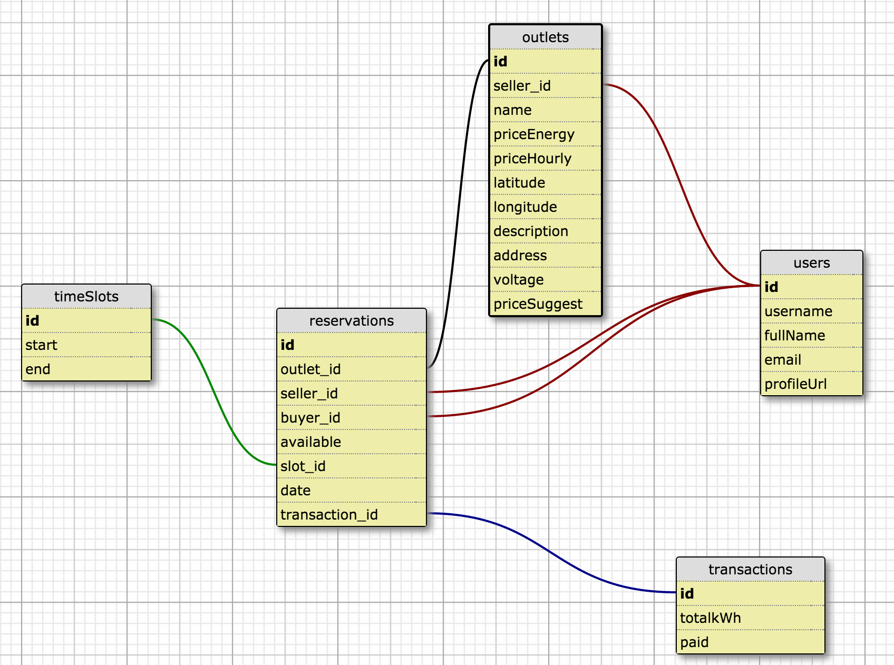

# Connectus

## About
Connectus is a peer to peer energy sales platform integrated with registered smart meters to monitor and control energy use.  

Users can register their meters for energy sales and/or make a reservation at an existing meter. During their reservation time, a user can turn the outlet on/off and monitor their energy usage. Connectus uses the [Modlet TE1010](http://shop.thinkecoinc.com/products/home-starter-kit#.VbZw6xNVikp) smart meter from ThinkEco, Inc. as a prototype for monitoring and controling energy use. Coming this week, [econnectus.co](http://www.econnectus.co/) will host the app and demo hardware features.

## Tech Stack
- Front End
  - React with Flux -- Utilizes unidirectional data flow for a modular, scalable app
  - GoogleMaps API -- Shows outlets by user input location
  
  - Bootstrap and Less -- Increases speed of styling and development
- Back End
  - MySql with Bookshelf.js -- Allows a complex relationship structure for user and meter information and their corresponding reservations and transactions
  - Socket.io -- Implements real-time data transfer between Modlet and the front end
  - BrainTree -- Incorporates both credit card and PayPal services
  - Passport -- Authorizes user with Facebook OAuth

## App Structure Notes
  - Flux utilizes [unidirectional data flow](https://facebook.github.io/flux/docs/overview.html) using Actions, Dispatchers, Stores and Views for efficient DOM manipulation
  - There are two servers -- the server and the powerServer. The server interfaces with the database and the powerServer maintains communication with hardware.
  - Connectus can run without a hardware connection, the only impact is a user cannot turn an outlet on/off or see live data updates
  
  - Database structure and relationships 

## Development
- __Web App__
  - Fork the repo.
  - Clone from your fork
  - npm install
  - bower install
- __Database__
  - [Install mysql](https://dev.mysql.com/doc/refman/5.6/en/osx-installation-pkg.html) (or brew install mysql) and start the mysql service with ``mysql.server start``
- __Hardware__
  - Connectus uses the [Modlet TE1010](http://shop.thinkecoinc.com/products/home-starter-kit#.VbZw6xNVikp) smart meter from ThinkEco, Inc. as a prototype for monitoring and controling energy use
  - To interface with the Modlet, use mcolyer's [hacklet program](https://github.com/mcolyer/hacklet) and follow instructions for integration
  - Turn on the Modlet and type "hacklet commission" into the terminal
- __Run the App__
  - gulp
  - nodemon server/server.js
  - nodemon powerServer/powerServer.js

## Team
Product Owners: Sean Connor, Valerie Liang  
Scrum Masters: Jammie Mountz, Dianna Faulk
